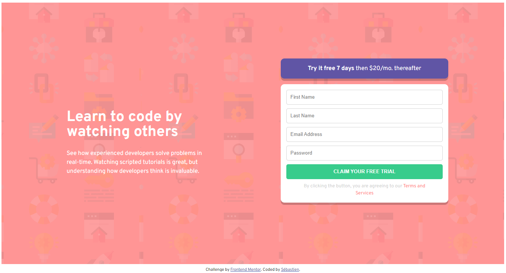

# Frontend Mentor - Intro component with sign up form solution

This is a solution to the [Intro component with sign up form challenge on Frontend Mentor](https://www.frontendmentor.io/challenges/intro-component-with-signup-form-5cf91bd49edda32581d28fd1). Frontend Mentor challenges help you improve your coding skills by building realistic projects. 

## Table of contents

- [Overview](#overview)
  - [The challenge](#the-challenge)
  - [Screenshot](#screenshot)
  - [Links](#links)
- [My process](#my-process)
  - [Built with](#built-with)
  - [Continued development](#continued-development)
  - [Useful resources](#useful-resources)
- [Author](#author)

## Overview

### The challenge

Users should be able to:

- View the optimal layout for the site depending on their device's screen size
- See hover states for all interactive elements on the page
- Receive an error message when the `form` is submitted if:
  - Any `input` field is empty. The message for this error should say *"[Field Name] cannot be empty"*
  - The email address is not formatted correctly (i.e. a correct email address should have this structure: `name@host.tld`). The message for this error should say *"Looks like this is not an email"*

### Screenshot

### Links

- Solution URL: [Component Form](https://intro-component-with-signup-form-lime.vercel.app/)

## My process

### Built with

- HTML5
- CSS with sass
- JavaScript
- React
- Flexbox
- Mobile-first workflow

### Continued development

- Redux revision

### Useful resources

- [CSS Tricks](https://css-tricks.com/snippets/css/a-guide-to-flexbox/) - very clear explanation.
- [MDN](https://developer.mozilla.org/) - What else...
- [React](https://fr.reactjs.org/)

## Author

Me